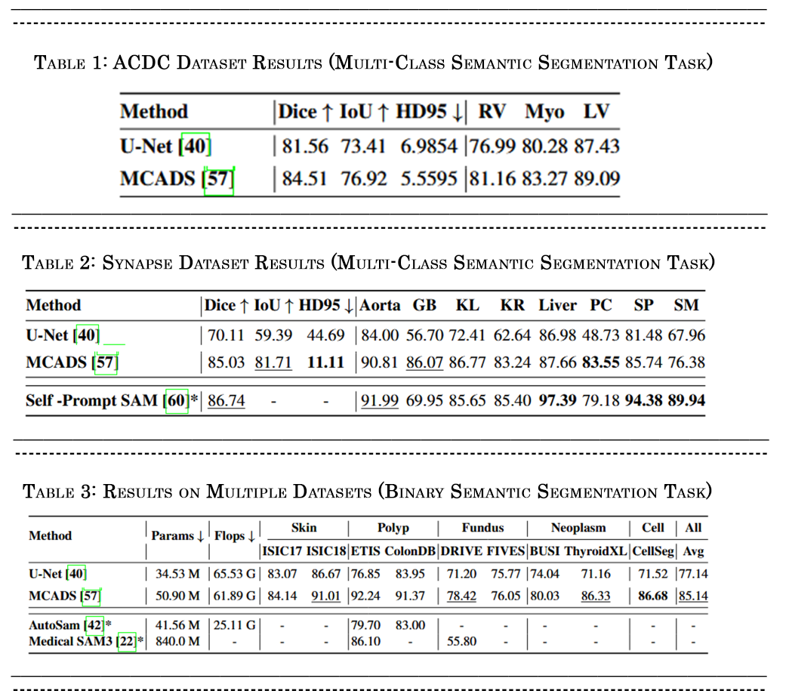

# MCADS-Decoder

**Rethinking Decoder Design:<br>Improving Biomarker Segmentation Using Depth-to-Space Restoration and Residual Linear Attention**
***- Accepted in CVPR 2025***


Download Paper:
https://openaccess.thecvf.com/content/CVPR2025/html/Wazir_Rethinking_Decoder_Design_Improving_Biomarker_Segmentation_Using_Depth-to-Space_Restoration_and_CVPR_2025_paper.html

Please Cite it as following

```
@inproceedings{wazir2025rethinking,
  title={Rethinking decoder design: Improving biomarker segmentation using depth-to-space restoration and residual linear attention},
  author={Wazir, Saad and Kim, Daeyoung},
  booktitle={Proceedings of the IEEE/CVF Conference on Computer Vision and Pattern Recognition},
  pages={30861--30871},
  year={2025},
  doi = {10.48550/arXiv.2506.18335},
  url = {https://doi.org/10.48550/arXiv.2506.18335}
}
```
_____________________________________________________________________________

 Experimental Results* on the [MedCAGD-Dataset-Collection](https://huggingface.co/datasets/saadwazir/MedCAGD-Dataset-Collection)



_____________________________________________________________________________
### Setup Conda Environment
use this command to create a conda environment (all the required packages are listed in `mcadsDecoder_env.yml` file)
```
conda env create -f mcadsDecoder_env.yml
```


### Datasets

#### MoNuSeg - Multi-organ nuclei segmentation from H&E stained histopathological images.
link: https://monuseg.grand-challenge.org/Data/

#### TNBC - Triple-negative breast cancer.
link: https://zenodo.org/records/1175282#.YMisCTZKgow

#### DSB - 2018 Data Science Bowl.
link: https://www.kaggle.com/c/data-science-bowl-2018/data

#### EM - Electron Microscopy.
link: https://www.epfl.ch/labs/cvlab/data/data-em/

### Data Preprocessing
After downloading the dataset you must generate patches of images and their corresponding masks (Ground Truth), & convert it into numpy arrays or you can use dataloaders directly inside the code. Note: The last channel of masks must have black and white (0,1) values not greyscale(0 to 255) values. 
you can generate patches using Image_Patchyfy. Link : https://github.com/saadwazir/Image_Patchyfy

### Offline Data Augmentation
(it requires albumentations library link: https://albumentations.ai)

use `offline_augmentation.py` to generate augmented samples


## Training and Testing

1. Edit the `config.txt` file to set training and testing parameters and define folder paths.
2. Run the `mcadsDecoder.py` file in a conda environment. It contains the model, training, and testing code.


---

## Configurations

- Paths for training
  
Define paths for folders that contain patches of images and masks for training.

```
train_images_patch_dir=/mnt/hdd_2A/datasets/monuseg_patches_augm/images/
train_masks_patch_dir=/mnt/hdd_2A/datasets/monuseg_patches_augm/masks/
```

- Paths for testing
  
Define paths for numpy arrays that contain patches of images and masks for testing.

```
test_images_patch_dir=/mnt/hdd_2A/datasets/monuseg_test_patches_arrays/monuseg_org_X_test.npy
test_masks_patch_dir=/mnt/hdd_2A/datasets/monuseg_test_patches_arrays/monuseg_org_y_test.npy
```

Define paths for folders that contain full-size images and masks for testing.

```
image_full_test_directory=/mnt/hdd_2A/datasets/monuseg_org/test/image/
mask_full_test_directory=/mnt/hdd_2A/datasets/monuseg_org/test/mask/
```

- Training Parameters
```
training=False
gpu_device=0
num_epochs=200
batch_size=8
imgz_size=256
```

- Evaluation Parameters
  
Parameters for processing patches of images and masks:
  
```
patch_img_size=256
patch_step_size=128
```
```
resize_img=True #set resize_img=False if full image sizes have different width and height.
resize_height_width=1024
```

Parameters for processing full-size images and masks:
  
```
resize_full_images=True #if resize_full_images=False then full-size images are not scaled down, but evaluation takes more time.
```


